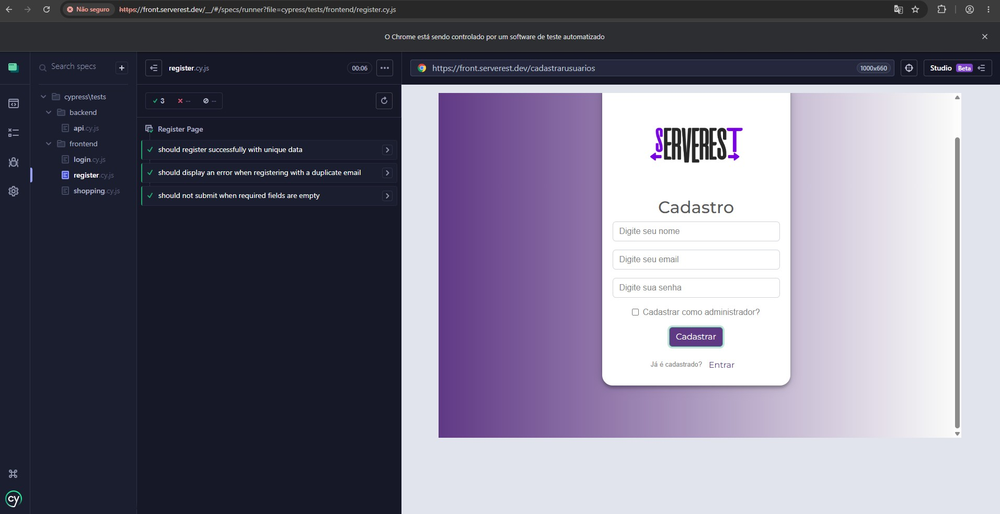
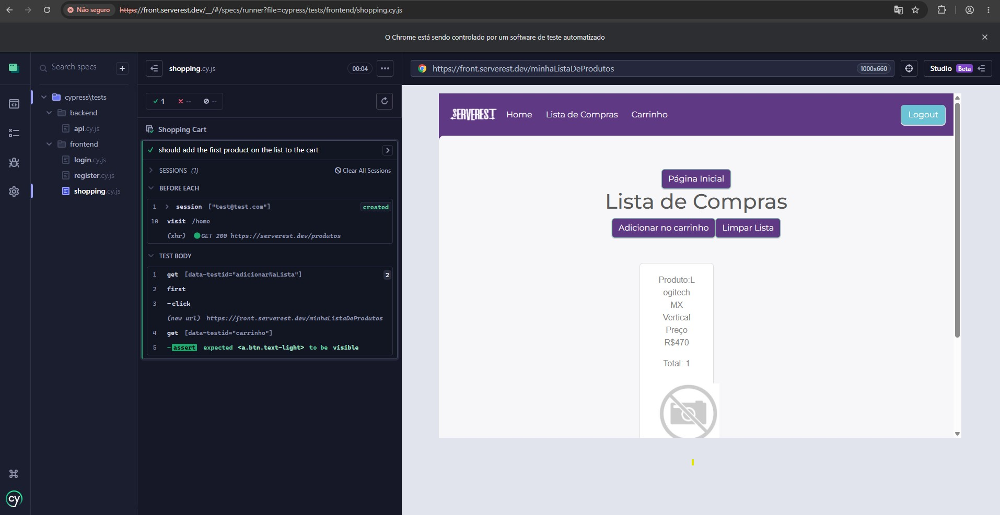
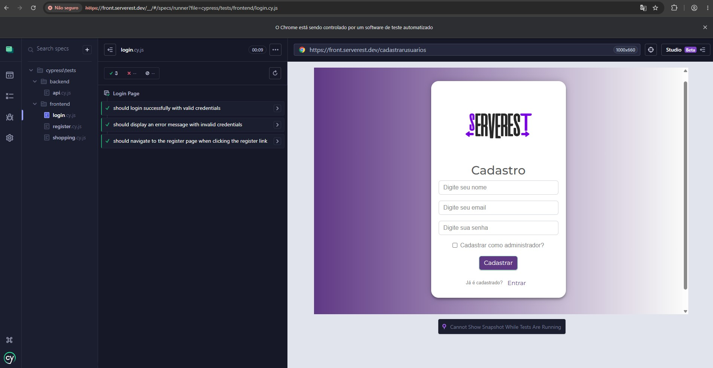
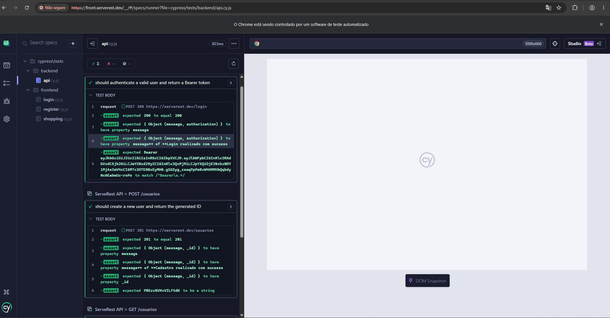

# ServeRest Test Suite

Automated test suite for [ServeRest](https://serverest.dev) using Cypress with the Page Objects pattern.

## Requirements

- Node.js
- npm

## Setup

```bash
npm install
```

## Running Tests

```bash
# Open Cypress UI
npx cypress open --env userPassword=<password>

# Run headless
npx cypress run --env userPassword=<password>
```

> Credentials are passed at runtime via `--env` to avoid storing passwords in version control.

---

## Project Structure

```
cypress/
├── fixtures/
│   └── users.json              # Test data (emails, names). No passwords.
│
├── support/
│   ├── selectors/
│   │   ├── loginSelectors.js   # Selectors for the login page
│   │   ├── registerSelectors.js# Selectors for the register page
│   │   └── homeSelectors.js    # Selectors for the home/products page
│   │
│   ├── pages/
│   │   ├── LoginPage.js        # Page Object for /login
│   │   ├── RegisterPage.js     # Page Object for /cadastrarusuarios
│   │   └── HomePage.js         # Page Object for /home
│   │
│   ├── commands.js             # Custom Cypress commands (cy.login, cy.getAuthToken)
│   └── e2e.js                  # Support entry point, loaded before every test
│
└── tests/
    ├── frontend/               # UI tests against front.serverest.dev
    │   ├── login.cy.js         # Login page scenarios
    │   ├── register.cy.js      # Register page scenarios
    │   └── shopping.cy.js      # Add product to cart scenario
    │
    └── backend/                # API tests against serverest.dev
        └── api.cy.js           # POST /login, POST /usuarios, GET /usuarios

cypress.config.js               # baseUrl, apiUrl env var, specPattern
cypress.env.json                # Local-only credentials (should be gitignored)
```

## Architecture

- **Page Objects** (`support/pages/`) encapsulate interactions with each page.
- **Selectors** (`support/selectors/`) keep element locators separate from logic.
- **Fixtures** (`fixtures/`) hold non-sensitive test data.
- **Custom commands** (`support/commands.js`) centralise reusable flows like login.
- **Passwords** are never stored in source files — always supplied via `--env` or CI secrets.





